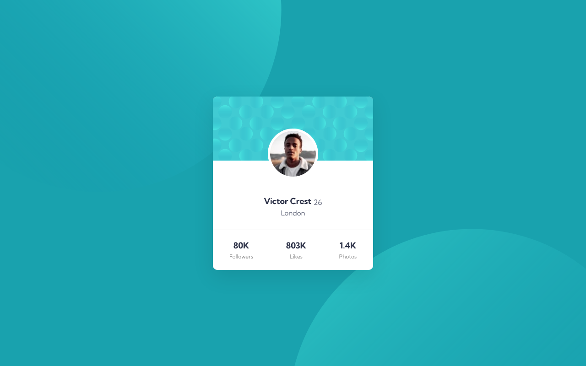

# Frontend Mentor - Profile card component solution

This is a solution to the [Profile card component challenge on Frontend Mentor](https://www.frontendmentor.io/challenges/profile-card-component-cfArpWshJ). Frontend Mentor challenges help you improve your coding skills by building realistic projects. 

## Table of contents

- [Overview](#overview)
  - [The challenge](#the-challenge)
  - [Screenshot](#screenshot)
  - [Links](#links)
- [My process](#my-process)
  - [Built with](#built-with)
  - [What I learned](#what-i-learned)
  - [Useful resources](#useful-resources)
- [Author](#author)

## Overview
- This is really a good challenge I have applyed flex box in this challenge. It looks simple but little bit challenging.
### The challenge

- The main challenging part was centering this card component. It took me for while to get the point.

### Screenshot

### Links

- Solution URL: [Add solution URL here](https://your-solution-url.com)
- Live Site URL: [Add live site URL here](https://your-live-site-url.com)

## My process
-My initial process was creating HTML structure This is where I make mistakes. It seems simple at first, but If your HTML structure is not good then you can not apply css styles to your elements properly. Once I created the HTML structure then I focused on layouting the component. 
### Built with

- CSS custom properties
- Flexbox
- Mobile-first workflow

### What I learned
- When I saw this desing on frontendmentor I thought it was easy, but when i started writing code I took more time than i expected mainly If you take any project from any resorses firstly we need to understand the structure of the desing we can't go strait writing code. This is what i learned from this project.
### Useful resources

- [Example resource 1](https://www.example.com) - This helped me for XYZ reason. I really liked this pattern and will use it going forward.
- [Example resource 2](https://www.example.com) - This is an amazing article which helped me finally understand XYZ. I'd recommend it to anyone still learning this concept.

## Author

- Frontend Mentor - [@yourusername](https://www.frontendmentor.io/profile/yourusername)
- Twitter - [@yourusername](https://www.twitter.com/yourusername)
